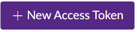

# canvas_extension_project

TEAM:            

Shay Merchant	 
Eric Thomas		 
Giuseppe Jeanty  
Nick Everette    
  

DEPENDENCIES: 
requests 
json 
ciso8601 
webbrowser 
json 
functools 
time 
datetime 
Pillow 
os 
pymsgbox 
tkinter 

 
A canvas extension that can pull a student users class info to make it more accessible.  

The extension only requires the student user to get a token from their institution, which can be obtained in the users account. 

After the user puts in their token, information such as announcements and assignments can be pulled from the desktop without having to log into canvas.  

ONLY WINDOWS IS SUPPORTED!
>

Getting token:

1.Log into your canvas account.</b></b>

2.Click on your account icon.</b></b>

 

3.Click on settings.</b></b>

 

4.Click on new access token.</b></b>

 

Running canvas companion:

1. You will be presented with an access window that asks for your token. You can choose to save your token or not.</b></b>

 

2. After entering your access token you will be presented with the courses window.</b></b>

 

3.You can choose the option of assignments or announcements for each course.</b></b>

3(assignments). If you choose an assignments button you will be taken to the assignments window.</b></b>

 

3(announcements). If you choose an announcement button you will be taken to the assignments window.</b></b>

 

If there are no announcements no announcements will be presented.</b></b>

 

New announcements will have new in green located next to them.</b></b>

Pressing the link for any announcement or assignment will take you to the submission or announcement page.</b></b>